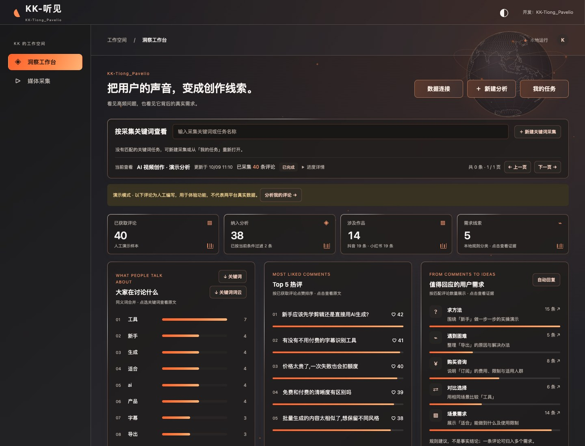
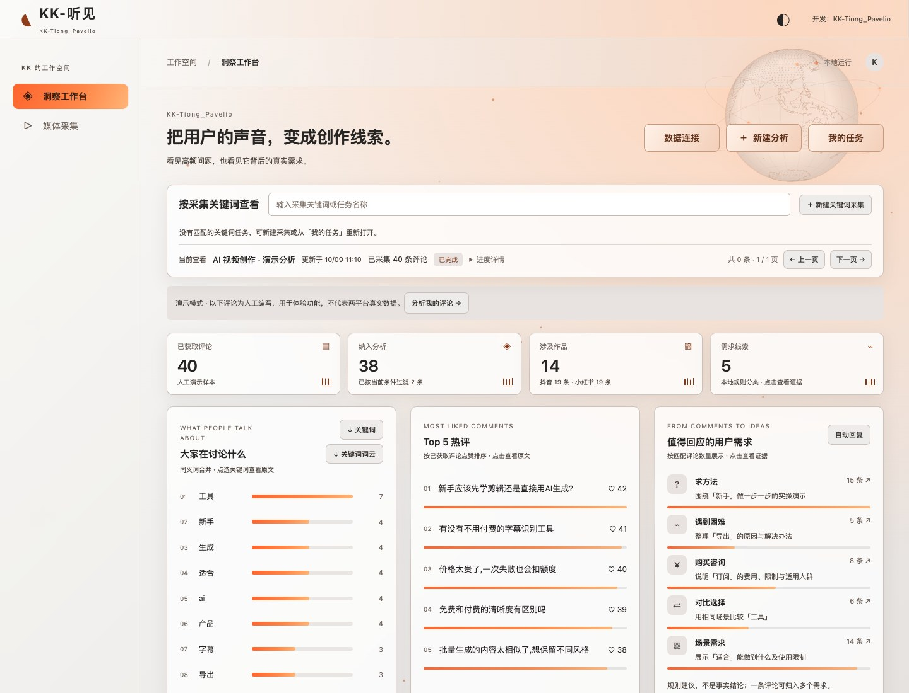
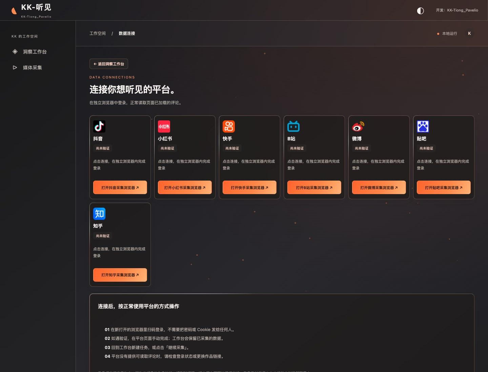
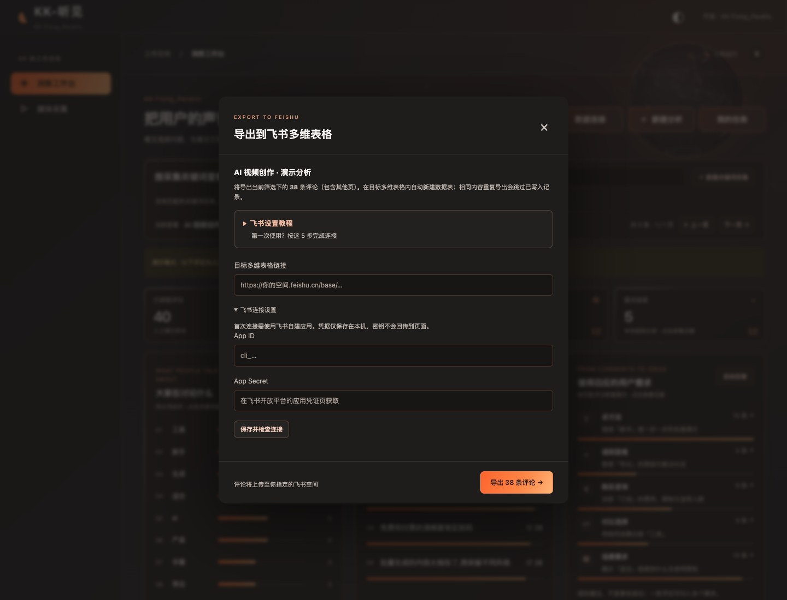
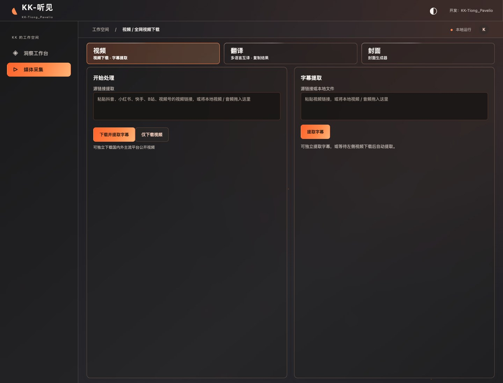

# 听见 · 评论洞察工作台

本地运行的抖音／小红书评论分析工具。输入作品链接、关键词，或创作者主页，将评论整理成关键词排行、需求线索及可回看的原文。

## 功能截图

以下截图来自当前版本的真实界面。评论为程序内置的人工演示数据；连接和飞书配置页展示未配置状态，不含个人采集记录或账号凭据。

### 洞察工作台 · 深色主题

查看评论统计、关键词排行、Top 5 热评和用户需求线索，按关键词回到原文。



### 洞察工作台 · 浅色主题

支持浅色、深色及跟随系统，适应不同使用环境。



### 平台数据连接

统一管理七个平台入口；在本机浏览器登录，实际可采集范围取决于平台与所选引擎。



### 飞书多维表格导出

按当前筛选导出评论，提供连接配置和设置教程；需使用者配置自己的飞书应用与表格。



### 视频下载与字幕提取

支持源链接和本地媒体输入，可下载并提取字幕，也可单独处理字幕。所需媒体组件另行安装。



[下载最新源码包](https://github.com/ichxjz/kk-tingjian-workbench/releases/latest)

## 打开

双击项目根目录 `启动工作台.command`，浏览器会打开本机工作台：

[http://127.0.0.1:5188](http://127.0.0.1:5188)

命令行：Node.js 24+，首次 `npm ci`，随后 `npm start`。

## 采集入口

- **作品链接**：粘贴抖音／小红书分享文本，可一次输入多个作品。
- **关键词搜索**：通过平台网页发现相关作品，再读取评论。需要平台页面正常返回搜索结果。
- **创作者主页**：通过可选的 MediaCrawler 增强引擎采集主页作品。历史导入数据仍可查看，当前界面不提供文件导入入口。

平台采集前，打开「数据连接」，在独立浏览器中完成登录或验证。账号凭据不用填写到工作台中。平台限制、登录失效或页面改版时，任务会保留已获得数据，并显示继续处理的入口。

## 已实现

- 本机 SQLite 持久化任务、评论、来源和收藏。
- 平台页面响应采集、一级及已加载的回复、可见 DOM 兜底、采集上限、暂停、未完成作品续采。
- 中文分词、同义词归并、关注词、排除词、日期范围、评论数／出现次数／作品数统计。
- 本地规则需求分类、选题建议、保留否定语境的基础情绪参考。
- 按平台、关键词、正文、需求类型、收藏筛选，回复上下文、原作品链接。
- 关键词表和筛选后的评论导出 Excel；评论也可导出 CSV。
- 新建分析、我的任务、数据连接；桌面、平板、手机布局。

## 边界与当前验证状态

- **本地闭环已验证**：导入、分析、原文、收藏、导出、去重、重启恢复。
- **采集代码已做受控浏览器测试**，不是平台真实数据的成功证明。
- **真实平台验证**：用户完成登录并提供新笔记链接后，小红书已实际采集 80 条评论（79 条纳入默认分析，44 条为回复），原文、作品 ID 和 Excel 导出已核对；当前为部分读取，不代表全量。小红书关键词搜索另获得2个作品共13条评论。抖音曾出现验证码，最新搜索页仍无作品结果，尚未通过真实评论采集验收。
- 早期未登录探测中，抖音出现验证码页、小红书搜索为空。登录状态及页面加载方式会影响可获取范围，不能声称全网稳定可抓。
- 页面采集使用正常页面响应；增强模式使用上游 MediaCrawler 的平台接口与签名实现。验证码由用户手动完成，不启用代理池；不调用收费服务。
- 评论洞察采用本地分词和规则分析；分类与选题建议不等于语义理解或事实结论。媒体字幕与封面模块可选装本地模型，在线翻译会将输入文字发送至界面注明的翻译服务。
- “完成”表示本次计划来源处理完毕；每个来源区分分页结束、达到上限、部分读取和待处理。回复只计实际展开／返回的部分，不能当作全部评论。
- 续采按作品保存进度；未完成作品重开后会重新加载页面并去重，不保留平台不可复用的网页游标。
- 来源、日期、作者缺失时仍可导入；界面显示缺失信息。无平台 ID 的内容指纹可能合并无法区分的相同评论。

## 验证

```sh
npm run verify
npm audit
```

`verify` 包含语法检查、数据/API 测试、浏览器交互测试、采集响应夹具测试，不需要平台登录；浏览器测试使用 Google Chrome，其他系统可设置 `BROWSER_EXECUTABLE`。

真实未登录探测：`node scripts/probe-platforms.mjs`。日志、截图、导出样本放在 `output/verification/`。

## 数据位置

- `.runtime/comments.sqlite`：本地数据库。
- `.runtime/profiles/`：独立平台浏览器配置，含本机登录状态，勿共享或提交。
- `src/`：服务端、分析、采集、网页。
- `tests/`、`scripts/`：验证脚本。
- `docs/架构与数据边界.md`：实现与真实数据获取边界。

服务仅绑定 `127.0.0.1`；网页不会公开到互联网。移动布局是响应式验收，不代表手机可以通过局域网直接访问。

## 2026-10-04 自查修复

- 采集：主评论分页结束后继续展开可见回复；独立回复关联父评论；短链接续采按真实作品合并计数；页面兜底与延迟响应避免同轮重复。
- 恢复：暂停期间保持任务占用，关闭服务等待保存；搜索异常按平台隔离，成功平台继续。
- 操作：刷新保留当前任务；更新后保留范围面板与导出格式；关键词导出遵循当前筛选；越界分页自动归位。
- 导入：拒绝重名和空 CSV 表头；无时区日期按北京时间解释；拒绝不存在的筛选日期。
- 验证：22项自动化测试、11项浏览器交互检查、双平台受控采集与短链接/延迟响应/回复展开回归通过。真实小红书续采80条均有平台ID且无重复，44条回复均有父评论。
- 更新前数据库备份位于 `.runtime/before-self-audit.sqlite`，仅本机保存。

## 导出到飞书多维表格

在评论列表的导出格式中选择「飞书多维表格」，点击「导出」。首次填写目标多维表格的 /base/ 链接、自建应用 App ID 和 App Secret。应用需要多维表格读取、创建数据表、读取和新增记录权限，并发布；在目标多维表格中将应用添加为可编辑协作者。

点击「保存并检查连接」可验证凭据和目标表格的读取权限；创建和写入权限以实际导出结果为准。密钥只保存在本机忽略目录 .runtime/feishu.json（权限600），不会回传到页面，也不要提交到代码仓库。

导出覆盖当前筛选下的全部分页。每份结果自动在目标多维表格内新建专用数据表，包含评论、平台、点赞、时间、作品链接、回复上下文、分类和收藏状态。相同内容再次导出跳过已写入记录；内容或筛选范围变化会建立另一份结果表。导出未完成时可重新点击继续，已成功写入的数据会核对后跳过。

暂仅支持飞书 /base/ 链接，知识库 /wiki/ 链接需先打开原始多维表格。首次真实导出需要用户配置自己的应用和目标链接；自动化验收使用模拟API，不代表已写入用户飞书空间。

接口依据：[新增数据表](https://open.feishu.cn/document/server-docs/docs/bitable-v1/app-table/create)、[批量新增记录](https://open.feishu.cn/document/server-docs/docs/bitable-v1/app-table-record/batch_create)、[自建应用凭证](https://open.feishu.cn/document/server-docs/authentication-management/access-token/tenant_access_token_internal)。

## MediaCrawler 增强采集

已接入 [NanmiCoder/MediaCrawler](https://github.com/NanmiCoder/MediaCrawler)，固定版本 bf28178082bc69989954f65a13a17bc129b9aa6e；来源与归档摘要见 docs/mediacrawler-source.json。第三方代码保存在 .runtime/vendor/MediaCrawler，保持原仓库文件及许可证；本项目通过独立 Python 桥接进程接入，不覆盖上游源文件。

- 「新建分析」默认选择已安装的增强采集；支持抖音、小红书、快手、B站、微博、贴吧、知乎。
- 支持关键词、作品链接和创作者主页；可选择是否包含二级回复。主页模式采集作品评论，不采集粉丝名单。
- 结果逐条进入原有数据库，继续使用分析、原文、收藏、Excel/CSV/JSON、飞书多维表格导出。关键词另可导出SVG词云。
- 同一时刻只运行一个采集任务，切换引擎前释放独立登录浏览器；登录配置沿用 .runtime/profiles，不读取用户日常浏览器配置。
- 暂停/继续采用重新读取并去重，不承诺恢复平台分页游标。所有结果只代表已读取样本。
- 本次接入聚焦评论工具：未开放媒体下载、代理池、短信接码、多账号或付费Pro功能。

重新安装增强环境：运行 npm run setup:mediacrawler。使用锁定依赖及独立虚拟环境，要求本机有 uv 和 Chrome；首次安装会下载依赖，后续启动不自动升级。安装脚本可沿用 macOS 已设置的下载代理，不改变系统配置。

上游为**非商业学习使用许可证1.1**，版权所有 © 2024 relakkes@gmail.com；未经作者书面同意不得商用。完整许可证在 src/public/mediacrawler-license.txt，并在采集界面提供入口。

### 自动回复（抖音 / 小红书）

在「值得回应的用户需求 → 自动回复」选择平台和需求类别，填写用语，勾选启用后保存。默认关闭、用语为空；后台只将启用后新采集的匹配评论加入队列，不回填已有评论，不处理演示和历史导入任务。页面导入及追加入口已移除，历史导入数据仍可查看、导出。

回复使用「数据连接」中的平台登录状态，在独立标签页操作。后台按平台评论标识定位，核对正文、作品、回复对象和实际请求内容，再发送；仅获得平台成功响应及新评论标识才记为成功。每条间隔至少60秒，结果不明或登录/页面变化会停止自动回复，不会自动重发。同一平台评论跨任务去重。修改设置会取消旧待发队列；「停止自动回复」阻止后续发送，已发出的请求仍核对结果。需在本机服务运行期间执行。

设置、进度及回复记录保存在本机 `.runtime/comments.sqlite`，不记录登录凭据。平台页面适配已通过受控浏览器夹具验证；真实账号发送未验收，首次使用请检查最近回复记录，不能将模拟验证视为平台实发成功。

## Mac 本地轻量版

发行包位于 `output/releases/`。将 `KK-听见.app` 放入应用程序后启动；只支持 Apple Silicon / macOS 14+。运行时已内置，个人数据在 `~/Library/Application Support/KK-Tingjian/`，大模型和增强采集按需安装。发行与验收说明见 [Mac本地轻量版发行](docs/Mac本地轻量版发行.md)。


## GitHub 源码包

仓库：`ichxjz/kk-tingjian-workbench`。源码包包含评论洞察、任务管理、数据连接、飞书导出及现有媒体工作台与 Mac 打包脚本。

```sh
git clone https://github.com/ichxjz/kk-tingjian-workbench.git
cd kk-tingjian-workbench
npm ci
npm start
```

需要 Node.js 24+ 和 Google Chrome。打开 http://127.0.0.1:5188/ ，在洞察工作台进入数据连接并自行登录平台。增强采集可运行 `npm run setup:mediacrawler`；媒体处理另见 [本地视频工作台](docs/本地视频工作台.md)。视频模型、Python/Swift 环境、FFmpeg 等不在源码包内；媒体处理主要面向 Apple Silicon macOS。Mac 程序构建条件见 [发行说明](docs/Mac本地轻量版发行.md)，构建脚本不是跨系统一键构建器。

源码包不包含采集数据、浏览器登录状态、飞书密钥、模型权重、node_modules、个人工作记忆、日志或验收素材。下载后需自行安装依赖和配置账号。该包为源码，不能当作已签名的桌面安装程序。

第三方组件授权边界见 [THIRD_PARTY_NOTICES.md](THIRD_PARTY_NOTICES.md)。
